# 🚀 MRADI Unified Command

**Mission Readiness, Assurance & Demo Intelligence**

> A mission-critical operations companion designed to support **MCx-class demonstrations, training scenarios, and pre-deployment validation** through real-time readiness assessment, telemetry monitoring, and governance-grade state provenance.


---

## 1. Purpose & Operational Context

### The Operational Problem

In public safety and critical communications environments, **demonstrations are operational events**.  
They involve live systems, real stakeholders, and zero tolerance for ambiguity.

Traditional demo setups fail because they:

- Detect failures too late
- Cannot explain _why_ readiness changed
- Encourage unsafe manual intervention under pressure

### The MRADI Approach

**MRADI (Mission Readiness, Assurance & Demo Intelligence)** provides a controlled operational layer that sits **alongside MCx-class systems**, delivering:

- Deterministic **readiness states** (READY / DEGRADED / NOT READY)
- Real-time **telemetry and service health**
- **Provenance-aware state transitions** (“what changed and why”)
- Safe, auditable **failure simulation** for training and demonstrations

The system is intentionally conservative, prioritising **operator trust and governance** over dense visualisation.

---

## 2. 🎥 Interactive Demo

__

> _GIF demonstrate live dashboard loading, service toggle simulation, and failover scenario with “Telemetry Lost” resilience state._

---

## 3. System Scope

MRADI is **not** a mission system.  
It is a **mission companion** designed for:

- Pre-sales demonstrations
- Customer workshops
- Operator training
- Integration dry-runs
- Readiness validation prior to live exercises

---

## 4. Technical Architecture Overview

MRADI bridges **strategic system records** with **operational telemetry**, enforcing readiness semantics at the interface.

```mermaid
graph TD
    %% --- THEME DEFINITIONS ---
    %% UI: Light Green Background, Dark Green Text/Stroke
    classDef ui fill:#d1e7dd,stroke:#0f5132,stroke-width:2px,color:#0f5132,font-weight:bold;
    %% CORE: Light Blue Background, Dark Blue Text/Stroke
    classDef core fill:#cfe2ff,stroke:#084298,stroke-width:2px,color:#084298;
    %% EXTERNAL: Light Gray Background, Dark Gray Text/Stroke, Dashed Border
    classDef external fill:#f8f9fa,stroke:#6c757d,stroke-width:1px,color:#343a40,stroke-dasharray: 5 5;
    %% User Endpoint Style
    classDef user fill:#fff,stroke:#333,stroke-width:2px,color:#333,stroke-dasharray: 5 5;

    %% --- DIAGRAM CONTENT ---
    User([🚀 Demo Operator]):::user -->|View Dashboard| UI[💻 Operational Dashboard]
    UI -->|REST API| API[⚡ FastAPI Backend]

    subgraph "Application Core (Python)"
        API -->|Fetch Data| SF[☁️ Salesforce Connector]
        API -->|Analyze| Risk[🧠 Risk Intelligence Engine]
        API -->|Monitor| Sys[🛡️ System Monitor]
    end

    subgraph "External Systems"
        SF <-->|JSON| Cloud[(Salesforce Cloud)]
        Sys -->|psutil| HW[🖥️ Host Hardware]
        Sys -->|Simulation| Virtual[👻 Virtual Service Registry]
    end

    %% --- APPLYING CLASSES ---
    class UI ui;
    class API,SF,Risk,Sys core;
    class Cloud,HW,Virtual external;
```



## 🏗️ Architectural Principles

MRADI Unified Command is built on **mission-critical engineering principles** to ensure operational reliability, governance, and situational awareness during high-stakes demo operations.

1. **Layered Architecture**

   - **Operational Layer:** Real-time telemetry, hardware monitoring, and service simulation.
   - **Strategic Layer:** Salesforce integration serving as the authoritative source of truth for assets and missions.
   - **Governance Layer:** Audit logging, compliance checks, and safety interlocks to prevent misuse or accidental live deployment.

2. **Fail-Safe & Resilience**

   - **Safety Interlocks:** `DEMO_MODE` assertions prevent simulation code from running in production.
   - **Debounce Logic:** Hardware alerts are only raised after sustained threshold breaches to prevent false alarms.
   - **Signal Loss Handling:** UI gracefully transitions to a “Gray State” rather than showing stale data.
   - **State Provenance:** Each status change is logged with cause and timestamp, providing a complete audit trail.

3. **Human-Centered Design**
   - Visual differentiation for system states (`READY`, `DEGRADED`, `NOT_READY`) to aid rapid operator comprehension.
   - Confirmation prompts for service toggles to reduce accidental operations during high-stress demonstrations.

---

## 📸 Proof of Work (Milestones)

The following artifacts demonstrate the **engineering progress and validation** of MRADI Unified Command. Each milestone represents an operationally testable component of the system.

| Milestone                       | Status       | Engineering Artifact                                                                                                                   |
| :------------------------------ | :----------- | :------------------------------------------------------------------------------------------------------------------------------------- |
| **1. Operations Core**          | ✅ Completed | Salesforce Schema Design for Asset & Mission Registry ([View Screenshot](docs/screenshots/01_salesforce_schema.png))                   |
| **2. Intelligence Link**        | ✅ Completed | Python API Connector successfully fetching mission & asset data ([View Screenshot](docs/screenshots/02_python_connection_success.png)) |
| **3. Pre-Flight Engine**        | ✅ Completed | Telemetry patch logic and service simulation verified ([View Screenshot](docs/screenshots/03_patch_success.png))                       |
| **4. Risk Algorithm**           | ✅ Completed | Risk scoring engine validated with test payloads ([View Screenshot](docs/screenshots/04_risk_assessment_payload.png))                  |
| **5. Containerized Deployment** | ✅ Completed | Docker image built and system started successfully in isolated runtime ([View Screenshot](docs/screenshots/05_docker_success.png))     |
| **6. Governance Check**         | ✅ Completed | Automated tests, GDPR purge, and dependency audit executed ([View Screenshot](docs/screenshots/06_governance_check.png))               |
| **7. Mission Dashboard**        | ✅ Completed | Interactive dashboard operational with live service toggles ([View Screenshot](docs/screenshots/07_dashboard.png))                     |
| **8. Live Telemetry**           | ✅ Completed | Real-time hardware monitoring and debounce logic verified ([View GIF](docs/screenshots/08_telemetry_hud.gif))                          |
| **9. Failure Simulation**       | ✅ Completed | Service failure handling and provenance logging validated ([View GIF](docs/screenshots/09_system_failure.gif))                         |

> **Note:** Each screenshot represents a verified engineering artifact, confirming **functional correctness and operator-ready status**.

---

## 🛠️ Key Engineering Features

- **🛡️ Signal Loss Protocol:** UI enters controlled “Gray State” if backend telemetry fails.
- **📉 Debounce Thresholds:** Sustained CPU/RAM thresholds trigger alerts only after consecutive breaches.
- **📜 State Provenance & Governance:** Full audit of every status change (`from` → `to` with cause and timestamp).
- **👻 Cold Start Handling:** UI pre-populates service states to avoid broken or empty dashboards.

---

## 📂 Project Structure

A standardized, container-ready directory structure designed for scalability.

```text
mradi-unified-command/
├── app/
│   ├── main.py            # FastAPI Entry Point & API Gateway
│   ├── system_monitor.py  # Telemetry, Simulation & Debounce Logic
│   ├── risk_engine.py     # Intelligence Logic (Unit Tested)
│   ├── audit_logger.py    # Governance & Logging
│   ├── sf_connector.py    # Salesforce Integration
│   └── static/            # Dashboard Frontend (HTML/CSS/JS)
├── tests/                 # Pytest Suite (Governance Layer)
├── scripts/               # Admin Tools (GDPR Purge)
├── Dockerfile             # Multi-stage Secure Build
├── docker-compose.yml     # Orchestration with Hot-Reload
├── requirements.txt       # Python Dependencies
└── README.md              # Project Documentation
```

## 🔍 Quick Check: Do these files exist?

Just to be 100% sure your project is actually clean, ensure these files have the correct content:

1. `.gitignore` (Should be in root)

   ```text
   # Security
   .env
   __pycache__/
   *.pyc

   # Virtual Environment
   venv/
   .pytest_cache/
   ```

2. `.dockerignore` (Should be in root)

   ```text
   # Build Efficiency - Keep image small
   .git
   .env
   venv/
   tests/
   scripts/
   __pycache__/
   *.pyc
   README.md
   ```

---

## ⚡ Quick Start

### Prerequisites

- Python 3.9+
- Docker & Docker Compose
- Salesforce Developer Edition Org

### Installation

1. **Clone the repository**

   ```text
   git clone [https://github.com/mirzazohaib/mradi-unified-command.git](https://github.com/mirzazohaib/mradi-unified-command.git)
   cd mradi-unified-command
   ```

2. **Configure Environment. Create a `.env` file with your Salesforce credentials**

   ```text
   SF_USERNAME=your_email
   SF_PASSWORD=your_password
   SF_TOKEN=your_security_token
   SF_CONSUMER_KEY=your_connected_app_consumer_key
   SF_CONSUMER_SECRET=your_connected_app_consumer_secret
   ```

3. **Run with Docker The system is pre-configured with `DEMO_MODE=True` for immediate simulation.**

   ```text
   docker compose up --build
   ```

4. Access the **Mission Control** dashboard at: `http://localhost:8000`

---

## ⚠️ Legal Disclaimer

This is a personal portfolio project created for educational purposes.

- **"SkySec Defense"** is a fictional entity used to simulate a regulated aerospace environment.
- This project is **not** affiliated with, endorsed by, or an official product of Airbus Public Safety and Security.
- All trademarks belong to their respective owners.

---
